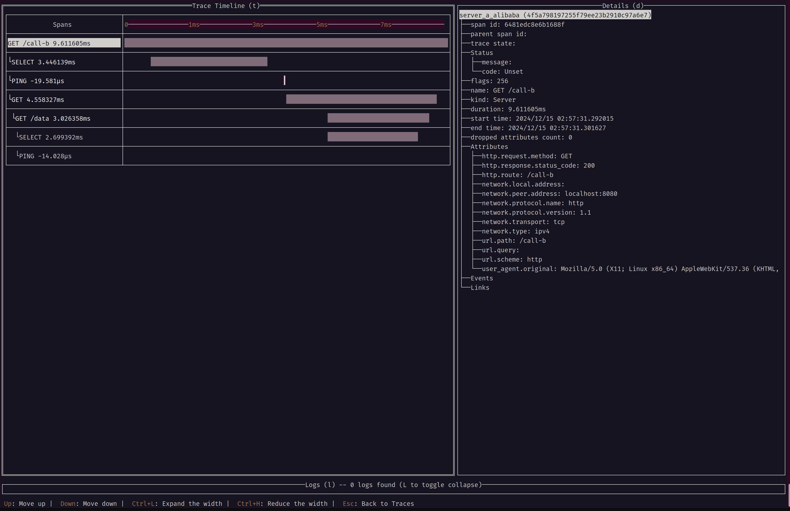

# go-auto-instrumentation-test
This repository is for testing the following OpenTelemetry Golang auto instrumentation:
- [open-telemetry/opentelemetry-go-instrumentation](https://github.com/open-telemetry/opentelemetry-go-instrumentation)
- [alibaba/opentelemetry-go-auto-instrumentation](https://github.com/alibaba/opentelemetry-go-auto-instrumentation)

## Getting started

- Run `docker compose up --force-recreate --build -d`
- In another terminal, run `docker compose attach oteltui`
  - This tool makes easier to view traces, metrics, logs. see: [otel-tui](https://github.com/ymtdzzz/otel-tui)
  - To stop, hit `Ctrl+p -> Ctrl+q`
- When you access to `http://localhost:8080/call-b`, you can see the traces and metrics generated by alibaba's instrumentation

- When you access to `http://localhost:8082/call-b`, you can see the traces generated by otel's instrumentation

- To stop, run `docker compose down -v`
